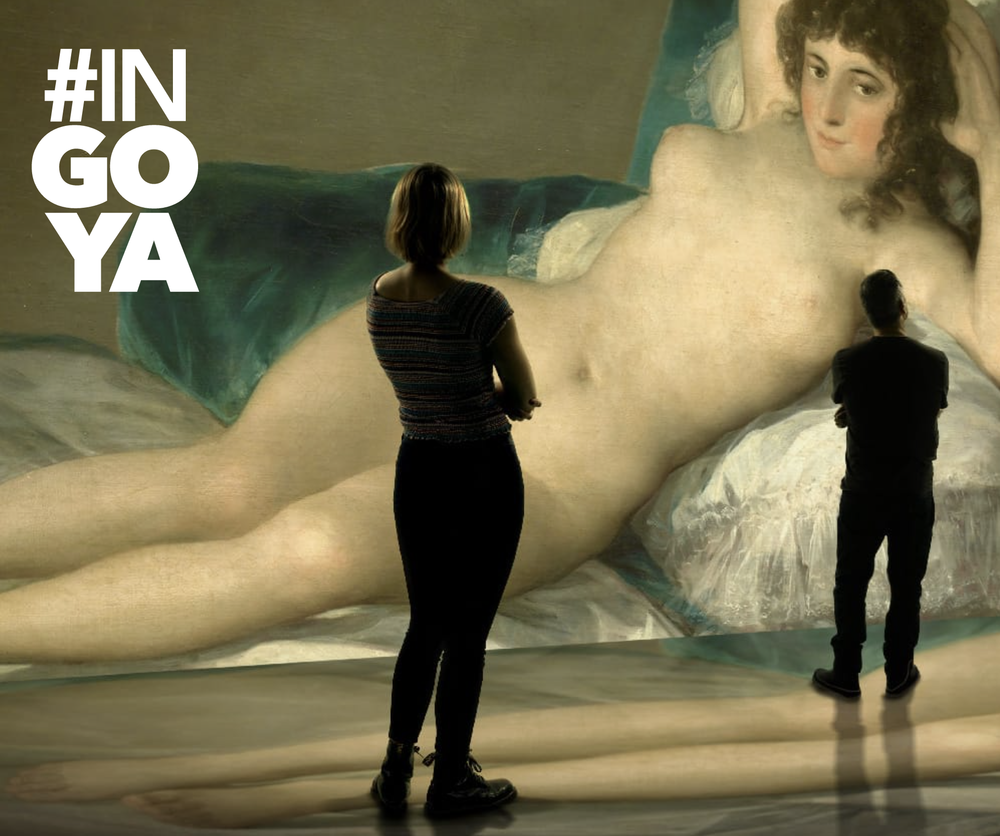
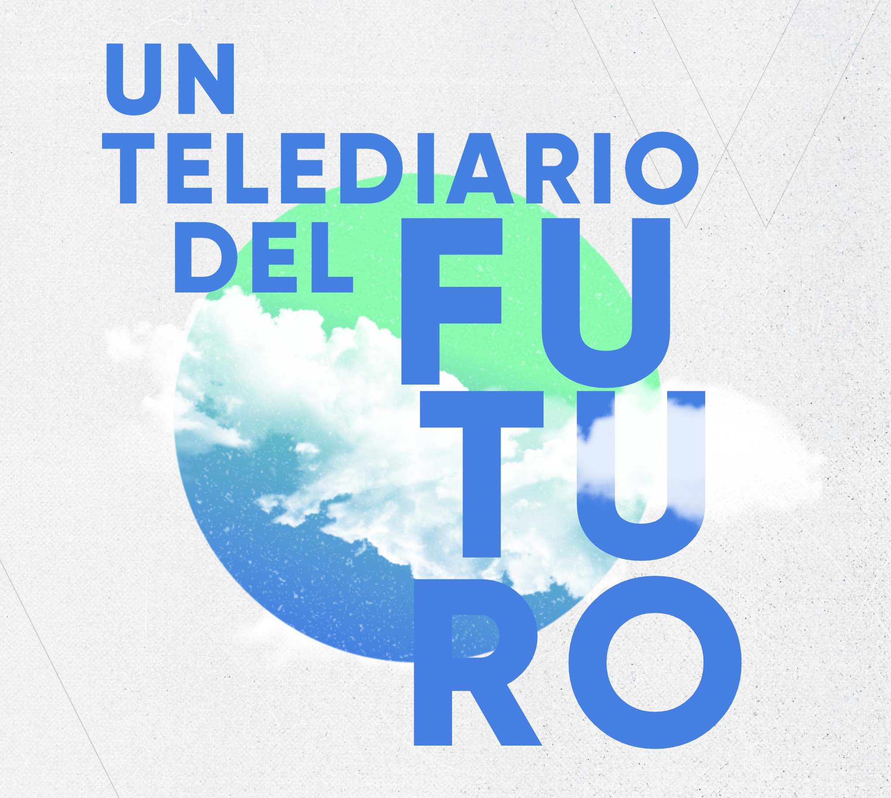

# RETO ACTIVIDAD 3. Visionando el futuro con las gafas de Manovich: redescubriendo la hibridación

## Dos ejemplos de hibridación ##

- Exposición inmersiva inGoya
- El telediario del futuro.
 

### Introducción ###

*Manovich* diferencia Multimedia con hibridación. En su libro explica que los medios multimedia son medios por separado, cuando visualizábamos un video, el ordenador está solo ejecutando ese video porque es su prioridad. Pensemos en los años noventa,  los ordenadores solo tenían capacidad para manejar algunos medios simultáneos pero su memoria era limitada y la velocidad de Internet no permitía visualizar animaciones complejas. Treinta años después el 4G y 5G nos permite una facilidad para poder entrelazar estos medios y  metamedios de forma nativa.

En la segunda parte de los noventa surge la hibridación de los medios combinando varios elementos multimedia que se perciben como un solo medio.
Citando a Manovich
 >Una vez los ordenadores se transformaron en cómodas casas donde habitaban un sinfín de medios simulados y nuevos, es natural esperar que empezarían a generar híbridos. Y esto es exactamente lo que ha venido sucediendo en esta nueva etapa de evolución de los medios.

En este ensayo hablaremos de dos ejemplos de hibridación, una nueva exposición inmersiva de Goya y dos maneras de ver la realidad en un telediario del 2050.

### Exposición inGoya ###

Hace meses visité una exposición inmersiva de Goya, yo la visité en Madrid, aunque ahora la exposición se puede ver en [Valencia](https://ingoya.com/). Si los museos grandes te abruman porque después de ver tres salas ya estás cansado de ver cuadros, pero al mismo tiempo te gusta ver arte, prueba con exposiciones inmersivas, es un nuevo método de consumir arte mucho más divertido.

Yo visité la exposición en el centro cultural de *Fernán Gómez*, era un recinto cerrado con poca visibilidad, para hacer que toda la iluminación estuviese en las paredes para visualizar los cuadros. Los cuadros ocupaban toda la pared, dos metros de alto como como muestra esta foto.

Una de las ventajas de las exposiciones de este tipo es que puedes hacer las fotos que quieras, cosa que en un museo no puedes. Así que como todo el mundo estaba haciendo fotos, pues yo también hice.

Cuando llegas a la sala, en una de las paredes, que luego se usarán para hacer la proyección, expusieron una cronología de toda la vida de Goya, eso fue para mi gusto lo que menos me gustó, no por la biografía de Goya en si, sino porque la gente no avanzaba y todas las personas permanecían en la entrada y si te tocan de los últimos poco ves. Podían proyectar varias cronologías de la sala porque había más sitio.

Luego llega la proyección con toda la obra pictórica de Goya, desde sus inicios, pasando por los cuadros que realizó para la corte de Carlos III, hasta los últimos años de su vida donde sus obra se volvió más tenebrosa gracias a la guerra de independencia (1808-1814).

Otra de las ventajas de las exposiciones inmersivas es disfrutar de su banda sonora al mismo tiempo que contemplas la obra de Goya y si te gusta la música tanto como a mi disfrutarás mucho escuchando a Manuel de Falla, Boccherini, Beethoven, Ravel, Tchaikovsky, entre otros. En esta [web]( https://ingoya.com/banda-sonora/) se puede escuchar su banda sonora.

### El telediario del futuro ###

En esta [web](https://lab.rtve.es/lab/telediario-2050-cambio-climatico/)la televisión RTVE grabó una serie de videos simulando que estamos en el 2050. Por cada tema hay dos videos uno utópico y otro distópico. Tratan varios temas como el trasporte, la agricultura, la energía, la migración y la climatología. Los videos distópicos describen una realidad que puede ser muy cierta si no se actúa sobre el cambio climático. Y los videos utópicos como su nombre indica es todo lo contrario ya que describen una realidad donde lo más importante es el cambio climático, la ecología y el bien estar por encima de los intereses gubernamentales y económicos.

Lo que más me gustó es que dentro del video hay otro video como si fuese un sketch donde el presentador del informativo vuelve al presente en un viaje en el tiempo y explica las consecuencias que tendrá el planeta si no se toman medidas sobre el cambió climático.

Estos videos fueron grabados en 2019, cuando se celebro en Madrid la Cumbre del Clima. Tengo la sensación de que durante estos tres años han pasado muchas más cosas que en los últimos diez años. Hablar del 2050 cuando acabamos de salir de una fuerte pandemia y ahora la guerra en Ucrania que no sabemos lo que va a pasar, hace pensar que el 2050 está demasiado lejos como para preocuparse. ¿Quién sabe? A lo mejor lanzan una bomba biológica con otro virus, pueden pasar tantas cosas hasta el 2050.

Pero volviendo a los vídeos, si queremos que no siga aumentando la temperatura del planeta, hay muchas cosas que día a día que podemos contribuir, como reciclar, usar el transporte público bajar un poco la calefacción etc. Por no hablar de todas las medidas que pueden tomar los gobiernos.

### Conclusión ###
Si analizamos la exposición inGoya con las gafas de Manovich pienso que sería una buena hibridación ya que combina los efectos de iluminación con el arte y la música.
En el segundo ejemplo expone información con videos y sus comentarios dentro de los mismos vídeos lo cual también es una técnica de hibridación.

### Bibliografía y referencias 
- Lev Manovich. 2013. *El software toma el mando* Editorial UOC
- El telediario del futuro. Recuperado el 4/05/2022 URL https://lab.rtve.es/lab/telediario-2050-cambio-climatico/
- Exposición inGoya. Recuperado el 12/05/2022 URL https://ingoya.com/
- Conocimiento Abierto y Tecnología. Recuperado el 10/05/2022 URL http://juan.psicologiasocial.eu/conocimiento-y-tecnologia
- Ferran Adell Remediación, multimedia e hibridación de los medios Recuperado el 10/05/2022 URL http://multimedia.uoc.edu/blogs/fem/es/remediacio-multimedia-i-hibridacio-dels-mitjans/

